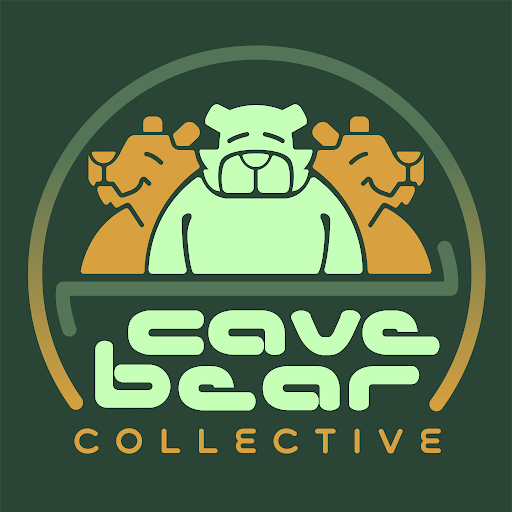
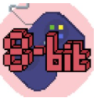
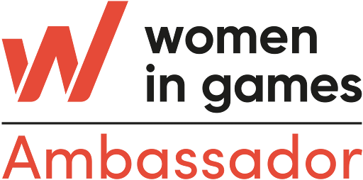

## RLG x Cave Bear Collective

Cave Bear Games is a grassroots, volunteer-driven indie video game non-profit studio. They have formed a community to help junior developers break into the game industry. Founded by Ayla Derrick, the studio empowers Rustling Leaves Games to connect with volunteers and fellow indie studios! Without them, we wouldn't have half of the talented volunteers and game development resources that we have, and we are thankful for their support!

For more information, check out the following resources:
- [ Website: cavebear.org](http://cavebear.org/)
- [ Discord](https://discord.gg/uz3pzJEz)
- [ Email: contact@cavebeargames.com](mailto:contact@cavebeargames.com)

## RLG x Center for International Studies Foundation

The Center for International Studies Foundation is an educational Nonprofit Organization that is helping us with Localization! They are helping our team understand cultural significance, language translation, and language accessibility, and bringing our narrative story to life in a realistic way! 

For more information, check out the following resources:
- [ Website: cis-foundation.org](https://www.cis-foundation.org/)
- [ Email: hey@cis-foundation.org](mailto:hey@cis-foundation.org)

## RLG x 8-Bit Consultancy

8-Bit Consultancy works with us to help design our Developer Agreements and Music License Agreements, manage risks, and audit our internal policies, and is led by their fearless leader, Mia Seljubac. We needed to set up our studio right the first time to make it a fair and equitable experience for everyone who joins the team, and 8-Bit Consultancy was the right choice!

For more information, check out the following resources:
- [ Website: 8bitlegal.com](https://8bitlegal.com/)
- [ LinkedIn](https://www.linkedin.com/company/8-bit-consultancy/about/)
- [ Email: mkseljubac@gmail.com](mailto:mkseljubac@gmail.com)

## RLG x Woman in Games Ambassadors

Woman in Games is a non-profit organization that connects and networks folks in the gaming industry with veteran professionals. We, as an indie studio, challenge ourselves to look at inclusion at the very beginning of development, remain involved, and believe in the strength of communities coming together and supporting each other in this industry; Women in Games allows us to do that. Several of our team members are proudly a part of the Women in Games Ambassadors program. 

For more information, check out the following resources:
- [ Website: womeningames.org](https://www.womeningames.org/)
- [ Discord](https://discord.com/invite/wigj)
- [ Email: hello@womeningames.org](mailto:hello@womeningames.org)
