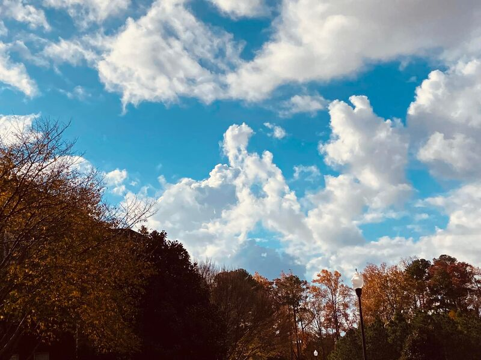

Dearest Community, 
Rustling Leaves Games was built on a vision, a dream where people can come together and build something beautiful. A group of like-minded individuals with full-time jobs, willing to pour sweat and tears into building a game that proves we are so much more than a number tossed to the side of a stack of papers on a recruiter's desk or a name at the start of a gut-wrenching Human Resources layoff email. Our vision is a community built game called Project Vertex.
Project Vertex takes place in the 1990s, in a small transient town where families from all over the world come together with one shared goal: to build a better life for themselves and their children. But this story isn’t about the hardships those families endured. Instead, it’s about their children, the quiet adventures happening between apartment buildings, the secret worlds built in nearby woods, and the memories that slowly fade as adulthood takes over.
This isn’t just a story about surviving. It’s about the experience of life.
The game is inspired by the passed down oral histories of families, friends and neighbors that recounted a time when imaginations turned mundane spaces into complex worlds of their own making. In Project Vertex, players are rewarded for asking “why?”, for exploring, and for seeing the magic in what others overlook.
At it’s heart, our hope is simple; this game connects to something small inside all of us. For those who turn to games as a way to escape the weight of life, we want to create a space where you don’t just escape, you feel present and connected. Part of something bigger.
The characters in our world are loosely inspired by real people from all over the globe, their childhood stories beginning the adventure into who they become as adults. 
Our team is currently in the concept phase, building prototypes and community, while shaping the foundation of what this world will become
We can’t wait to share more with you soon!

